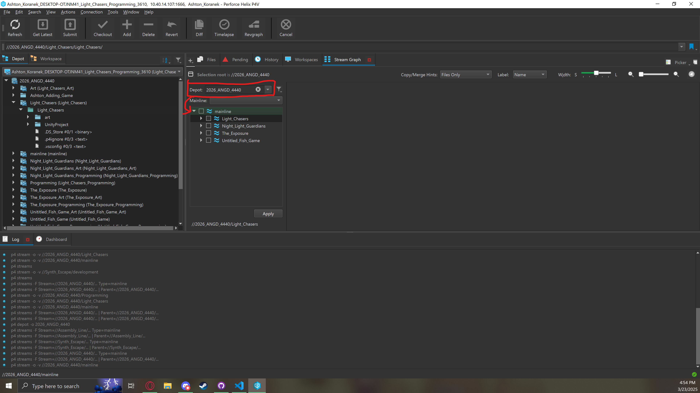
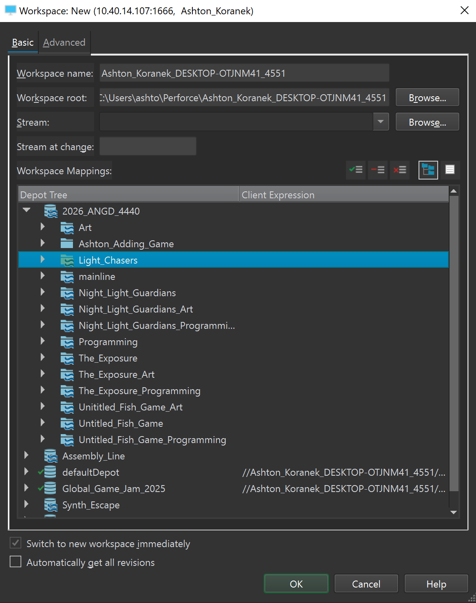

### [Back to the Table of Contents](../Perforce/General_InformationPerforce.md)

# How to create a perforce Workspace

# There is two Different ways to Create a workspace in P4V I highly recommend the first way as it will lead to less problems when submitting

### Workspaces Information
* Workspaces are local versions of the Depot that are used to download the files that are uploaded to the server and when done working upload the files in your workspace to the depot. **For a tutorial on how to upload your work go [here](UploadWork.md)**

# 1st Method

1. Log Into P4V (if you need help doing that [here](PerforceLogin.md)) you will see this and you need to open the ``Stream Graph``. To do that click the button at the top left of the screen called ``View`` then in the drop down click ``Stream Graph``.

# 

2. After opening that it should pop up on the right side and with a menu that looks like the picture below. What you need to do is first select the depot you will need for this example im choosing ``2026_ANGD_4440`` as it is the one for our senior projects. After that you should see the ``mainline`` stream. You wanna click the arrow next to it and open up the sub-streams and then find the project you are working on. I'll use ``Light Chasers`` for this example.

# 

3. After finding the Stream you are looking for you want to click the box and make sure there's a checkmark in the box then you want to press the ``Apply`` button. After you press apply it should show up like the image below 

# 

4. If you see that menu you then want to right click the stream that you are going to use for artists it will usually just be the titled ``Name of Project``_Art. After right clicking you wanna to press the button ``New Workspace``

# 

5. This menu should pop up and from here you just need to press the ``Ok`` Button at the bottom of the screen

# 

6. You will end up back at the main menu and you need to click the workspace button next to the Depot button and you should see a folder with nothing in it. Click the folder and the ``Get Latests`` button at the top should light up and be clickable. You then click the button to get the latest version of the depot. **NOTE it's always a good practice to always get the lastest before working so that you aren't working on a old version of the depot saved to your computer**

#

7. This isn't really a step however if you wanna see the files in the file explorer instead of in P4V you can right click any of the files then hover over the ``Show in`` section then click ``Show in Explorer``

# 2nd Method

1. After logging in (if you need help doing that [here](PerforceLogin.md)) you should see this screen and you will need to click the ``Workspace`` button which is marked below. **Note if there's already a workspace their you can just click is still**

#

2. When clicked it should provide a drop down that looks like the image below. If you have workspaces they should be there and if you need one that is already created click it. However if you are creating a new one click ``New Workspace`` 

#

3. This menu should pop up and to make sure you only get what you want click the button that is in a box on the image below.

#

4. If there's anything in the text box like what I have in the image below you should **DELETE** all of the text till there's nothing left in the box and then go back to the other menu by clicking the button next to the button that got you to this screen If there was nothing in the box then just keep going forward in the tutorial.

#

5. Now that you are here and there isn't any residual depots being added you want to find the depot that you are going to use for this example im using light chasers you will **RIGHT CLICK** the depot that you want to use and then click ``Include Tree`` then you wanna just press the ``ok`` button on the bottom right. **NOTE if you wanna move the workspace directory to a place that is easy to save to and find like the desktop you need to go to the top where is says ``Workspace root`` and click ``Browse`` then you will select a folder to put the root in.** 

# 

6. You will end up back at the main menu and you need to click the workspace button next to the Depot button and you should see a folder with nothing in it. Click the folder and the ``Get Latests`` button at the top should light up and be clickable. You then click the button to get the latest version of the depot. **NOTE it's always a good practice to always get the lastest before working so that you aren't working on a old version of the depot saved to your computer**

#

7. This isn't really a step however if you wanna see the files in the file explorer instead of in P4V you can right click any of the files then hover over the ``Show in`` section then click ``Show in Explorer``

### [Back to the Table of Contents](../Perforce/General_InformationPerforce.md)

