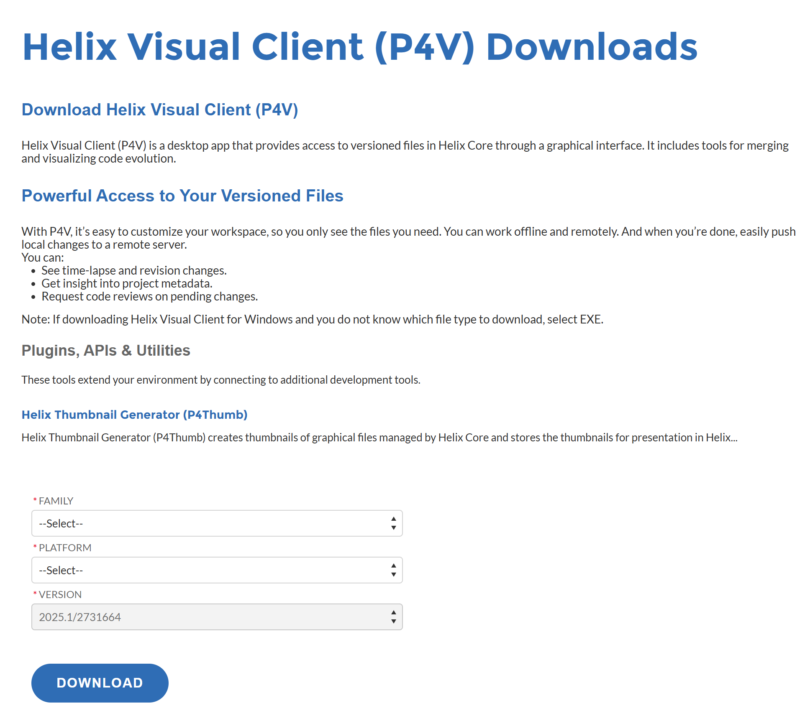
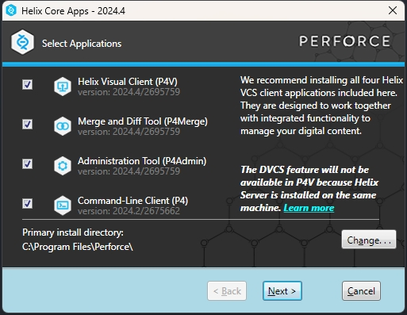
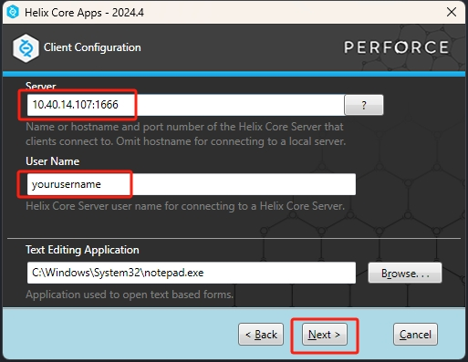
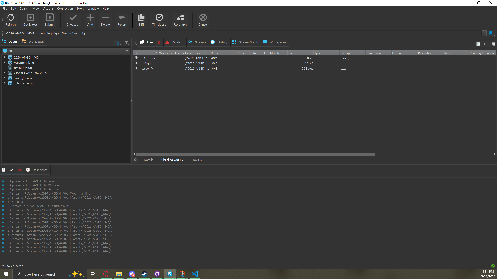
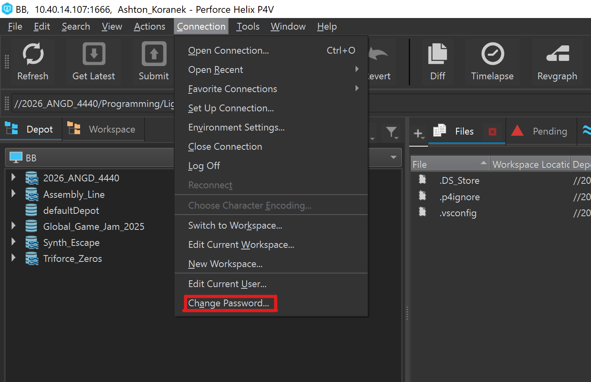
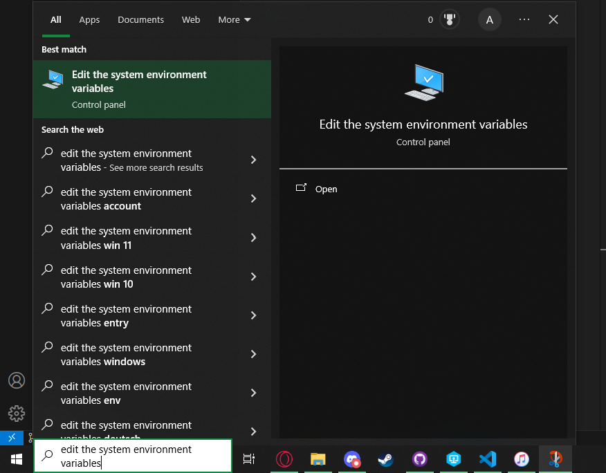
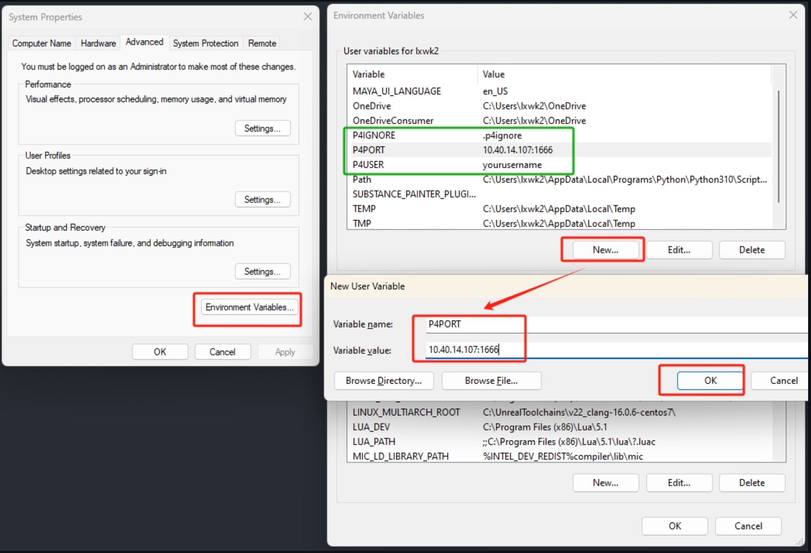

### [Back to the Table of Contents](../Perforce/General_InformationPerforce.md)

# Perforce First Setup
This doument will be used to show off the first time setup for users and should only need to be looked at once and after you would hopfully only need the [Login Tutorial](PerforceLogin.md)

# IMPORTANT
**If you are accessing the Perforce server while not connect to a school WIFI like the ``uiw-students`` network or the ``uiw-resnet`` network you HAVE to use a VPN to access the perforce server. If you need to access with a VPN here is a link with a explanation about how to do it made by Professor Li [here](https://github.com/Arbint/UIWPerforce/blob/master/Documentation/WorkingFromHome.md). If you have any questions about this step fill free to ask me about it**

# Downloading the Perforce Visual Client and setting it up
1. the first step is well... downloading the Perforce Visual Client or P4V which is what I will be calling it from now on. The link to download P4V can be found [here](https://portal.perforce.com/s/downloads?product=Helix%20Visual%20Client%20%28P4V%29). 

# 

2. After clicking the link you should see a webpage that looks like the image below. Their is only two  things you need to change before you click the download button the ``Family`` and the ``Platform``. For the ``Family`` tab you would choose what operating system you are using with your choices being ``Linux`` ,``macOS`` , and ``Windows``. After that in the ``Platform`` tab should if you chose ``macOS`` or ``Linux`` for your ``Family`` it should be fine but if you chose ``Windows`` then you will need to choose the option titled ``Windows(x64)(EXE)``. After that you are good and can then just click the download button.

&nbsp;&nbsp;&nbsp;&nbsp;&nbsp;&nbsp;&nbsp;&nbsp;&nbsp;&nbsp;

# 

3. Now that you have it downloaded you can find the installer in the ``Downloads`` folder of the file explorer on your computer it should show up looking like this if it does open it

&nbsp;&nbsp;&nbsp;&nbsp;&nbsp;&nbsp;&nbsp;&nbsp;&nbsp;&nbsp; 

# 

4. The Next Screen you will see is this one and you want to make sure that you have all of the four boxes checked before you go to the next step

&nbsp;&nbsp;&nbsp;&nbsp;&nbsp;&nbsp;&nbsp;&nbsp;&nbsp;&nbsp;

# 

5. The Next Screen you should see is this one you will need to change the ``Server`` and the ``User Name`` before you finish. The ``Server`` Section should be ``Insert Server IP Here`` and the ``User Name`` should be the first part of your UIW email for example my email is ``koranek@student.uiwtx.edu`` so my User Name should be ``koranek`` **if this is not correct for any reason or you suspect you dont have a account send a E-Mail to Professor Li asking about cause he is the only one that is able to edit accounts**

&nbsp;&nbsp;&nbsp;&nbsp;&nbsp;&nbsp;&nbsp;&nbsp;&nbsp;&nbsp;

# 

6. After that the it should download and then you will be able to launch P4V threw the ``Start menu``/``Windows menu`` 

&nbsp;&nbsp;&nbsp;&nbsp;&nbsp;&nbsp;&nbsp;&nbsp;&nbsp;&nbsp;

# 

7. After Launching the you will see the screen below you will see the same two things as in step 5 with the ``Server`` and ``User`` you will put in the exact same thing as in that step.

&nbsp;&nbsp;&nbsp;&nbsp;&nbsp;&nbsp;&nbsp;&nbsp;&nbsp;&nbsp;&nbsp;

# 

8. If you were able to put all that in correctly then you should be sent to the main menu which looks like this (PS if yours is in light mode and you want it in dark mode at the top click ``Edit`` then in the dropdown click ``Preferences`` in there go to the ``Display`` tab and one of the options in there is to set it to dark mode).

&nbsp;&nbsp;&nbsp;&nbsp;&nbsp;&nbsp;&nbsp;&nbsp;&nbsp;&nbsp;&nbsp;  

# 

9. The next step you need to do it set your password to do to that in the top left of the screen click the ``Connections`` then in the drop down click ``Change Password``

&nbsp;&nbsp;&nbsp;&nbsp;&nbsp;&nbsp;&nbsp;&nbsp;&nbsp;&nbsp;&nbsp;

# 

10. Now that you have done all of that you can close the P4V client
- 1. You need to open your system variables which you can do by opening your ``starting menu``/``Windows menu`` and putting in ``edit the system environment variables`` you shouldnt need to put all of it but do so if you wanna be safe

&nbsp;&nbsp;&nbsp;&nbsp;&nbsp;&nbsp;&nbsp;&nbsp;&nbsp;&nbsp;&nbsp;&nbsp;&nbsp;&nbsp;&nbsp;&nbsp;&nbsp;&nbsp;&nbsp;&nbsp;&nbsp;

- 2. After opening that it should look like the image on the left and you wanna click ``Enviornment Variables`` and then the window on the right should show up. What you wanna do is click the ``New`` button which will pop up a new window with a ``Variable Name`` and a ``Variable Value``. You will need to create three new user variables with this button. The First one should have a ``Variable Name`` of ``P4PORT`` and a ``Variable Value`` of the Server IP which should be ``insert ip here`` then you will just press ``ok`` and it should show up in the list. The second one should have a ``Variable Name`` of ``P4USER`` and the ``Variable Value`` should be **Your** user name you used to sign in earlier. The last one you need to add should have a ``Variable Name`` of ``P4IGNORE`` and the ``Variable Value`` should be ``.p4ignore``. 
**MAKE SURE YOU PAY ATTENTION TO WHAT IS AND ISNT CAPATILIZED IN THE NAMES AND VALUES AS THEY ARE IMPORTANT**

&nbsp;&nbsp;&nbsp;&nbsp;&nbsp;&nbsp;&nbsp;&nbsp;&nbsp;&nbsp;&nbsp;&nbsp;&nbsp;&nbsp;&nbsp;&nbsp;&nbsp;&nbsp;&nbsp;&nbsp;&nbsp;

### [Back to the Table of Contents](../Perforce/General_InformationPerforce.md)