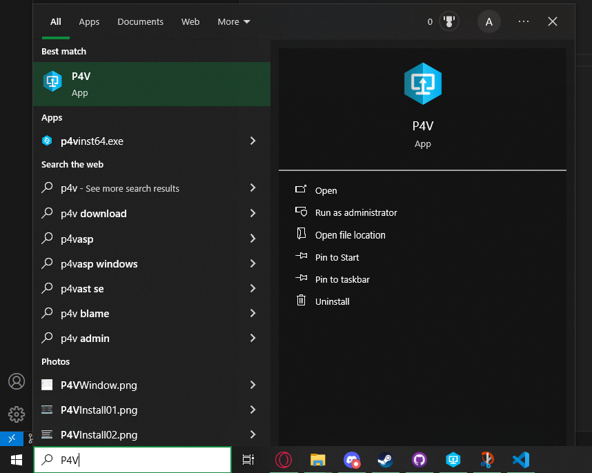
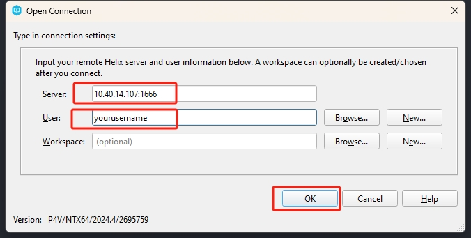
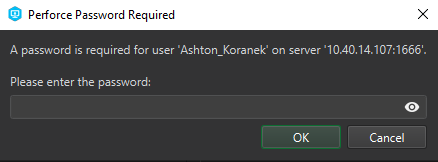

### [Back to the Table of Contents](../Perforce/General_InformationPerforce.md)

# Perforce Login Tutorial

1. After that the it should download and then you will be able to launch P4V threw the ``Start menu``/``Windows menu`` 

# 

2. After Launching the you will see the screen below you will see that you need a ``Server`` and ``User`` the server should be ``insert server ip here`` and the ``user`` should be the first part of your school email for example my Email ``koranek@student.uiwtx.edu`` the thing I would put in the ``user`` section sould be ``koranek``

# 

 

3. after putting in the ``server`` and the ``user`` and clicking ``ok`` if everything was correct you should end up seeing this screen asking for your password. uh... I dont know your password so... put in your password. If you dont know your password then E-Mail Professor Li as he is able to see and edit passwords. 

### [Back to the Table of Contents](../Perforce/General_InformationPerforce.md)
