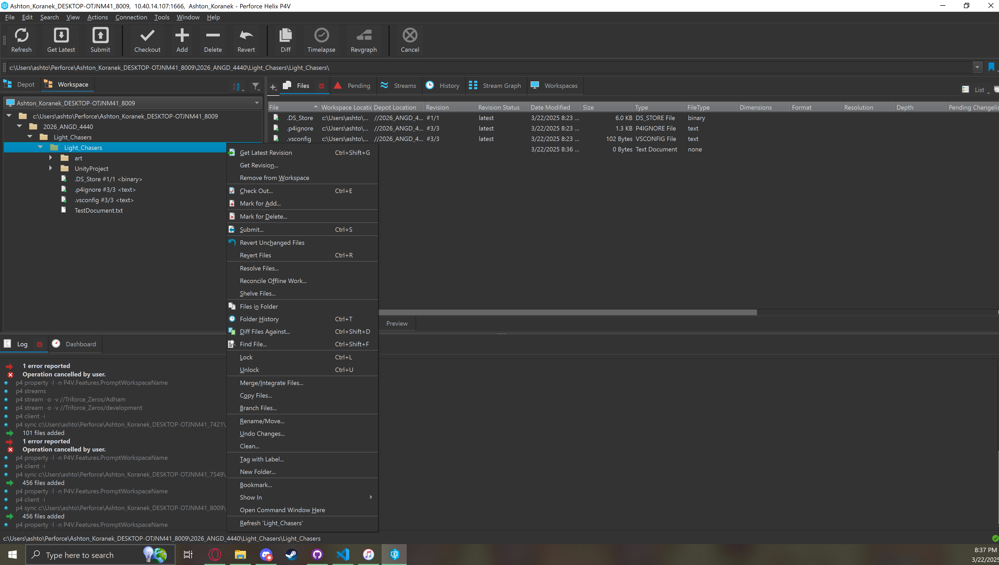
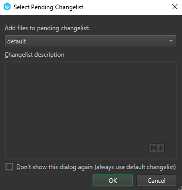
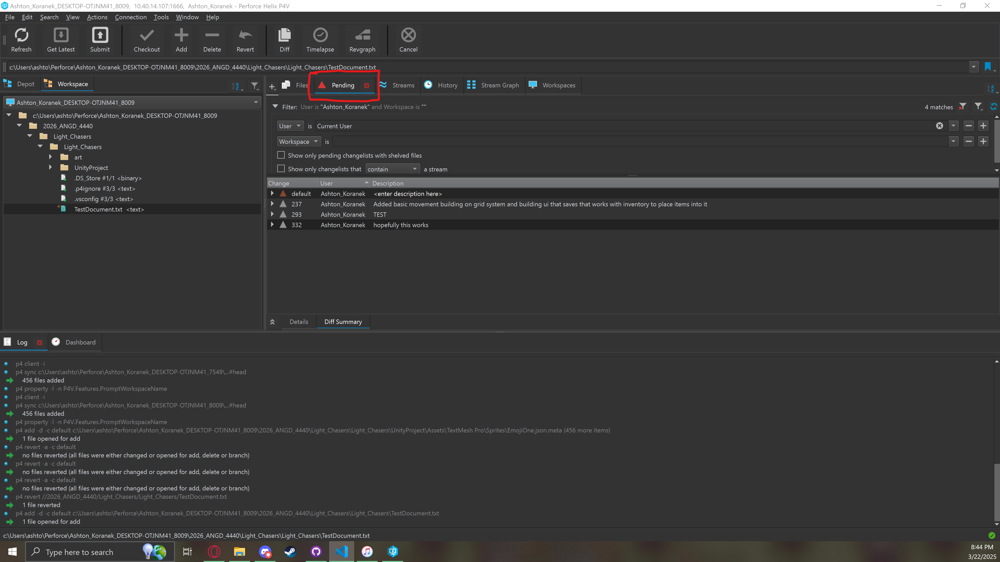
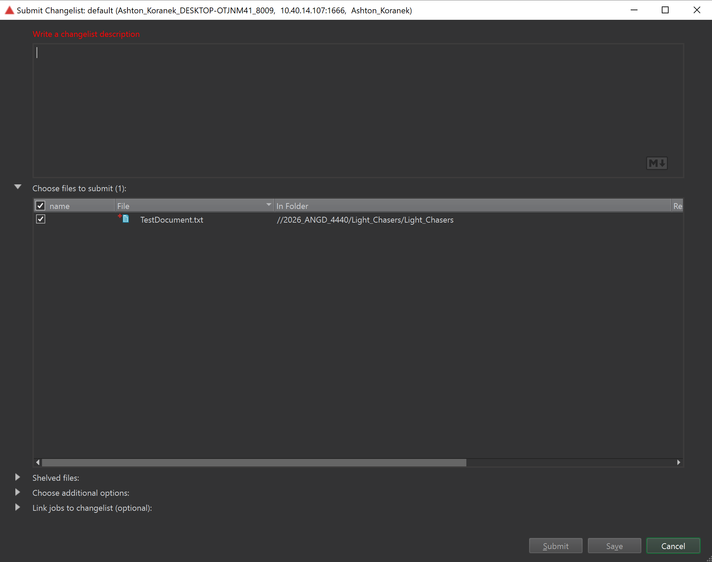

# Perforce Upload Work Tutorial

1. After you have saved everything to the workspace that you have been using you will want to open P4 to the workspace and then **right click** all of the folders that have new or edited files that you either added or edited. After right clicking the folder from the new menu you wanna click ``Mark For Add``

# 

2. You should get this popup just press the ``ok`` button

#

3. After doing that for all of the folders that contain new or edited files you wanna click the ``Pending`` button **NOTE if you dont see the pending tab you can click the ``View`` button at the top then click Pending Changelist and it should appear** after going to the pending tab you should see that the ``Default`` change is pending shown off by the red triangle. You wanna then just double click the default changelist

#

4. This menu should pop up. Basically the top is a description you will write about what you are about to sumbit so if you finished a model or animation say thats what you did. The bottom half is the files you are submiting. By default it should have everything checked but fill free to check to make sure everything is getting submitted. After writing a description and making sure its got all of your files you will click the ``Submit`` button at the bottom and you should be good **NOTE This is usually where something breaks so if something does fill free to try and contact me if you need help**
 
